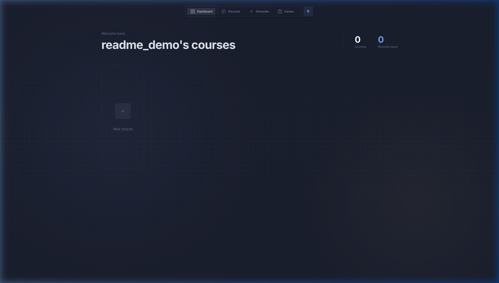
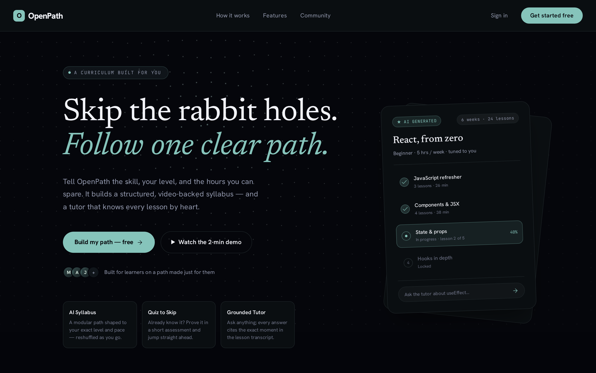
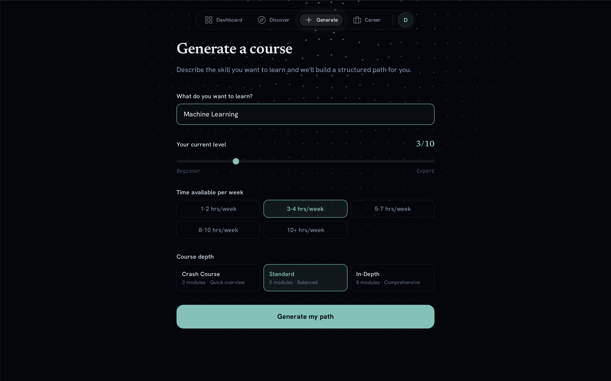
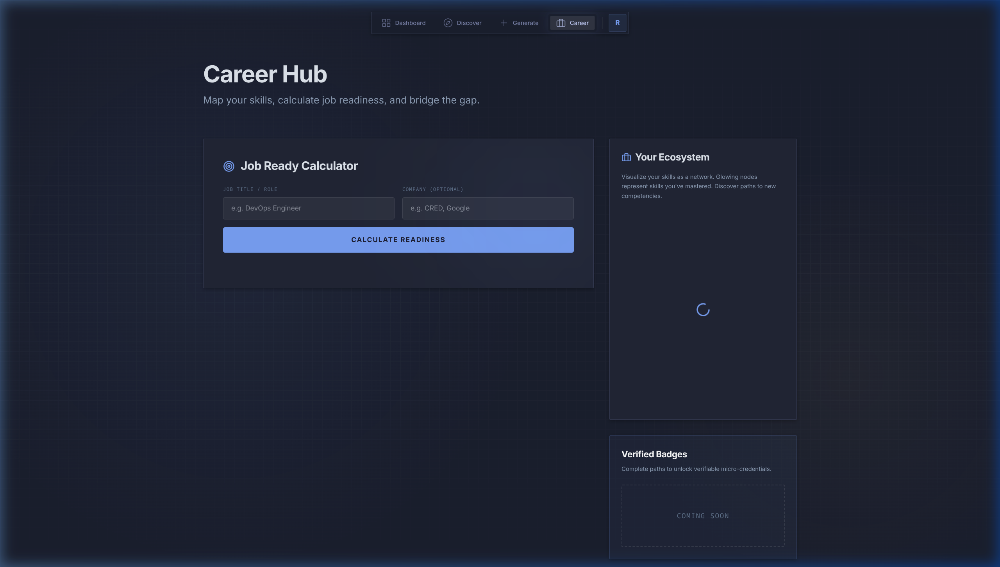

# OpenPath — AI-Powered Personalized Learning Path Finder

[](https://www.python.org/)
[](https://nodejs.org/)
[](https://fastapi.tiangolo.com/)
[](https://tailwindcss.com/)
[](https://ai.google.dev/)
[](LICENSE)

OpenPath is an advanced, AI-driven personalized learning platform that transforms any skill, goal, or complex topic into a highly structured, manageable educational journey. By leveraging Google Gemini 2.5 Flash for syllabus generation and transcript-based analysis, combined with a custom YouTube Relevance Ranking Engine, OpenPath maps out modules with high-quality educational videos and interactive study tools.

The interface is built around a custom-tailored Tokyo Night (Pastel Dark) aesthetic with Swiss-style typography, clean spacing, and modern transitions.

---

## System Screenshots

### Core Dashboard Interface
The learning dashboard displays your active courses, overall progress, and specific learning path modules.


### Features and Pages

#### Premium Landing Page
The entry point featuring clean typography, feature highlights, and one-tap Google Sign-In.


#### AI Syllabus Generator
Specify your target skill, starting expertise, time commitment, and watch a complete module syllabus construct dynamically.


#### Career Hub and 2D Skill Graph
Evaluate job readiness against targeted professional roles and map out your skills in a physics-based, D3-powered force graph.


---

## Key Features

*   **Intelligent Syllabus Generation**: Specify any topic, active skill level, and weekly time commitment. Gemini 2.5 Flash dynamically outputs structured modules with custom sub-topics and search queries.
*   **Context-Aware Video Ranking**: A multi-signal search curation service queries YouTube and scores candidates based on channel authority (trusted educational creators), semantic skill intersection, recency, and instructional duration.
*   **Quiz-to-Skip (Adaptive Skip)**: Accelerate past topics you have already mastered. The backend parses video transcripts to create highly relevant comprehension tests. Score at or above 80% to skip modules instantly.
*   **Live AI Tutor Chat**: Ask follow-up questions directly inside a module. The AI tutor uses the actual transcript of the video as context, explaining intricate concepts or answering queries without leaving the player.
*   **Offline Study Notes**: Generate full, structured markdown summaries of any learning module, including key concepts, equations, and code snippets compiled from transcript context, ready to be exported for offline study.
*   **AI-Distilled Flashcards**: Active module transcripts are processed into interactive Q&A study flashcards to reinforce memory retention and recall.
*   **Career Hub & Skill Graph**: Connect learning to professional outcomes. Evaluate job readiness against targeted roles (e.g., Machine Learning Engineer at Google). Visualizes your overall skills as an interactive 2D Force-Directed Skill Graph.
*   **Community Marketplace**: Share completed learning paths publicly to the community marketplace, or clone and enroll in roadmaps designed by other learners.

---

## Tech Stack

### Backend
*   **Core API Framework**: FastAPI (Asynchronous Python server)
*   **ORM / Database**: SQLAlchemy + Alembic (SQLite local database with automatic migrations, configurable for PostgreSQL)
*   **AI Orchestrator**: Google Gemini 2.5 Flash API (via `google-genai` SDK)
*   **Authentication**: Google Sign-In only (Google Identity Services ID-token flow) — the frontend obtains a signed Google credential, the backend verifies it with `google-auth` and issues its own session JWT via `python-jose`. No passwords are stored or accepted.
*   **Data Scrapers**: `youtube-search-python` and `youtube-transcript-api`

### Frontend
*   **Base Framework**: React 19 + Vite (Vibrant single-page application)
*   **Design & Styling**: TailwindCSS v4 (Tokyo Night customized palette & tokens)
*   **Animations**: Framer Motion (Micro-interactions, spring animations, and tab transitions)
*   **Graph Visualizations**: React Force Graph 2D (D3-powered physical network layouts)

---

## Getting Started

### Prerequisites
*   Python 3.10+
*   Node.js 18+
*   Gemini API Key (Get a key from Google AI Studio)
*   Google OAuth 2.0 **Client ID** (type: *Web application*) — sign-in requires it. See [Google Sign-In Setup](#google-sign-in-setup) below.

---

### Google Sign-In Setup

Sign-in is Google-only, so you need an OAuth Client ID before the app is usable:

1.  In the [Google Cloud Console](https://console.cloud.google.com/), go to **APIs & Services → Credentials → Create Credentials → OAuth client ID**, and choose **Web application**.
2.  Under **Authorized JavaScript origins**, add the origins you'll serve from:
    *   `http://localhost:5173` (Vite dev server)
    *   `http://localhost` (Docker frontend on port 80)
    *   `https://your-domain.com` (production)
3.  Leave **Authorized redirect URIs** empty — the ID-token flow doesn't use a redirect endpoint.
4.  Under **APIs & Services → OAuth consent screen (Audience)**, add yourself as a **Test user**, or **Publish** the app so any Google account can sign in (basic `email`/`profile` scopes need no verification review).
5.  Copy the generated Client ID (`…apps.googleusercontent.com`) — this is a **public** value (no client secret is used in this flow) and goes into your `.env` as `GOOGLE_CLIENT_ID`.

---

### Local Installation

#### 1. Setup Backend Server
Navigate to the repository root directory:
```bash
# Create a virtual environment
python -m venv venv
source venv/bin/activate  # On Windows use: venv\Scripts\activate

# Install Python requirements
pip install -r requirements.txt

# Setup environment configuration
cp .env.example .env
# Edit .env and supply GEMINI_API_KEY, GOOGLE_CLIENT_ID, and (for production) JWT_SECRET_KEY
```

To run the backend server:
```bash
cd backend
uvicorn main:app --reload
```
The backend API will run on http://localhost:8000 with interactive Swagger documentation available at `/docs`.

#### 2. Setup React Frontend
Navigate to the frontend directory:
```bash
cd react-frontend

# Install dependencies
npm install

# The Vite dev server reads its own .env (the root .env is backend-only).
# Point the Google button at your Client ID:
echo "VITE_GOOGLE_CLIENT_ID=your-client-id.apps.googleusercontent.com" > .env

# Run Vite dev server
npm run dev
```
The React frontend dashboard will open at http://localhost:5173.

> **Note:** `VITE_GOOGLE_CLIENT_ID` must be set for the "Sign in with Google" button to render. For `npm run dev` it comes from `react-frontend/.env`; the Docker build instead bakes it in from the root `.env`'s `GOOGLE_CLIENT_ID` (see below).

---

### Docker Containerized Setup

You can launch the entire stack (PostgreSQL database, FastAPI backend, and Nginx-served React frontend) with a single command. First fill in the root `.env` — compose fails fast if any required value is missing:

*   `GOOGLE_CLIENT_ID` — required (feeds both backend token verification **and**, at build time, the frontend bundle)
*   `JWT_SECRET_KEY` — required; generate a strong value: `python -c "import secrets; print(secrets.token_hex(32))"`
*   `POSTGRES_PASSWORD` — required (avoid `@`, it breaks the connection string)
*   `GEMINI_API_KEY` — optional (falls back to mock responses if blank)

```bash
# Build and spin up all services
docker compose up --build -d
```
*   React Frontend is exposed on http://localhost (port 80)
*   FastAPI backend is exposed on http://localhost:8000 (port 8000)

> **`GOOGLE_CLIENT_ID` is baked into the frontend bundle at build time.** If you change it (or set it for the first time), you must rebuild the image with `--build` — a plain restart keeps the stale bundle and the Google button won't render.

#### Production

Production uses an explicit overlay that adds TLS/nginx and keeps the backend off the public internet:

```bash
docker compose -f docker-compose.yml -f docker-compose.prod.yml up -d --build
```

Set `CORS_ORIGINS` to your HTTPS domain(s), add that domain to the Client ID's **Authorized JavaScript origins** in Google Cloud Console, and edit `docker/nginx.prod.conf` + run `scripts/init-letsencrypt.sh` for certificates. Note that Postgres only applies `POSTGRES_PASSWORD` when its data volume is **first** created — changing it later requires re-initializing the volume or running `ALTER USER` inside the db container.

---

## Project Structure

```text
OpenPath/
├── assets/                    # Project screenshots and design mockups
├── backend/                   # FastAPI REST API & Gemini Orchestration
│   ├── alembic/               # Database migrations
│   ├── routers/                # FastAPI routers (auth, courses, modules, quiz, career)
│   ├── tests/                  # pytest suite
│   ├── auth.py                 # App JWT creation/decoding + Google ID-token verification
│   ├── database.py             # SQLAlchemy engine, session maker, DB base
│   ├── main.py                  # FastAPI app composition root & middleware configuration
│   ├── migrate_db.py            # Auto-migration utilities
│   ├── models.py                # SQLAlchemy database schemas
│   ├── schemas.py                # Pydantic data schemas
│   └── services.py               # Gemini 2.5 Flash prompts, transcript generation, YouTube search
├── legacy/streamlit/           # Legacy/Prototyping Streamlit interface (superseded by react-frontend)
├── react-frontend/            # High-fidelity React UI (Tokyo Night design)
│   ├── src/
│   │   ├── components/ui/     # Reusable Tokyo Night atomic components
│   │   ├── features/          # Core views (CareerHub, LiveTutor, OfflineNotes)
│   │   ├── App.jsx            # Main dashboard manager & page state router
│   │   ├── index.css          # Tailwind CSS v4 directives & custom themes
│   │   └── main.jsx           # App entry point
│   ├── tailwind.config.js     # Tailwind configurations
│   └── vite.config.js         # Vite configuration file
├── docker/                    # Docker infrastructure config files
├── docker-compose.yml         # Containerized services orchestrator
├── requirements.txt           # Python application packages list
├── requirements-dev.txt       # Test-only dependencies (pytest, httpx, pytest-mock)
└── README.md                  # Comprehensive project documentation
```

---

## REST API Reference

The FastAPI backend exposes the following primary endpoints. You can explore standard parameters and test endpoints at `/docs`.

| Method | Endpoint | Description | Auth Required |
| :--- | :--- | :--- | :---: |
| **POST** | `/auth/google` | Verify a Google ID token, upsert the user, and return a JWT access token | No |
| **GET** | `/auth/me` | Fetch active user profile from JWT session | Yes |
| **POST** | `/generate-course` | Core Gemini engine generating syllabus and YouTube ranking | Yes |
| **GET** | `/courses` | Retrieve list of all enrolled learning paths for user | Yes |
| **GET** | `/courses/public` | Fetch all public paths published to the marketplace | No |
| **GET** | `/courses/{id}` | Deep fetch course metadata and module roadmap details | Yes / Public |
| **PATCH** | `/courses/{id}/visibility` | Toggle a path's public/private status | Yes |
| **POST** | `/courses/{id}/enroll` | Clone a public community course to a user's dashboard | Yes |
| **POST** | `/modules/{id}/complete` | Mark module complete (verifies active video watch time) | Yes |
| **PATCH** | `/modules/{id}/notes` | Update rich text learning notes for a module | Yes |
| **GET** | `/modules/{id}/flashcards` | Generate AI-extracted flashcards from video transcript | Yes |
| **GET** | `/modules/{id}/has-transcript` | Check if video has transcript for AI capabilities | No |
| **POST** | `/generate-quiz` | Construct custom module comprehension check (Quiz-to-Skip) | Yes |
| **POST** | `/submit-quiz` | Submit score; automatically marks module complete if passed | Yes |
| **POST** | `/modules/{id}/chat` | Interactive chat with Gemini-driven expert Live Tutor | Yes |
| **GET** | `/modules/{id}/offline-notes` | Export clean markdown notes for local offline studying | Yes |
| **POST** | `/career/job-ready` | Evaluate matching score against target roles and companies | Yes |
| **GET** | `/career/skill-graph` | Generate interactive skill connections map for force graph | Yes |

---

## License

This project is licensed under the [MIT License](LICENSE). Feel free to adapt and expand for your personal learning endeavors.
