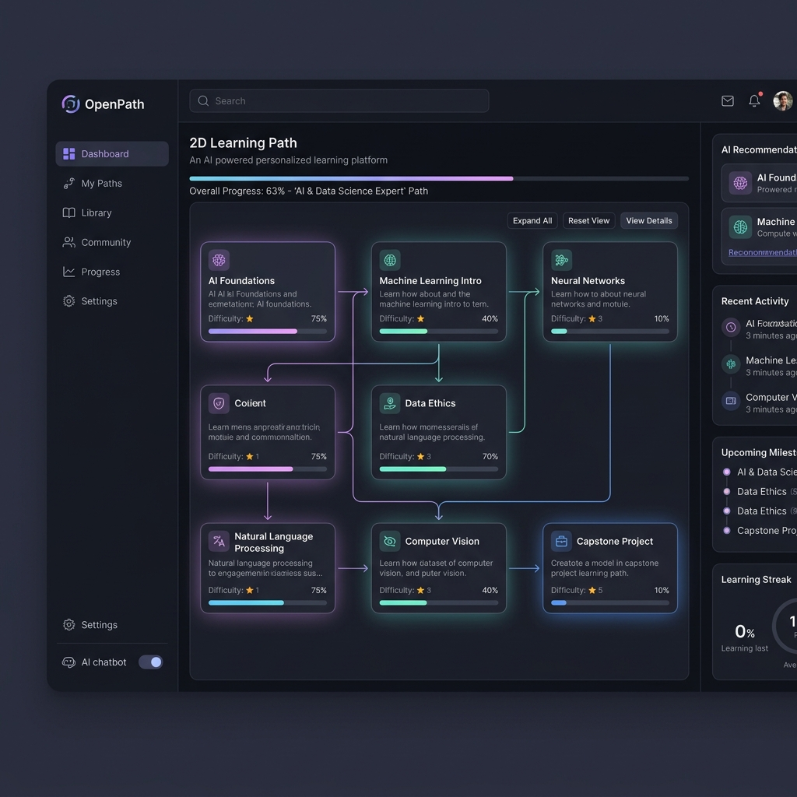

# 🌌 OpenPath — AI-Powered Personalized Learning Path Finder

[](https://www.python.org/)
[](https://nodejs.org/)
[](https://fastapi.tiangolo.com/)
[](https://tailwindcss.com/)
[](https://ai.google.dev/)
[](LICENSE)

OpenPath is an advanced, AI-driven personalized learning platform that transforms any skill, goal, or complex topic into a highly structured, manageable educational journey. By leveraging **Google Gemini 2.5 Flash** for syllabus generation and transcript-based analysis, combined with a custom **YouTube Relevance Ranking Engine**, OpenPath maps out modules with high-quality educational videos and interactive study tools.

The interface is built around a premium, custom-tailored **Tokyo Night (Pastel Dark)** aesthetic with smooth typography, fine spacing, and deep interaction.

---

## 🎨 System Mockup (Tokyo Night Aesthetic)



---

## 🚀 Key Features

*   **🧠 Intelligent Syllabus Generation**: Specify any topic, active skill level, and weekly time commitment. Gemini 2.5 Flash dynamically outputs structured modules with custom sub-topics and search queries.
*   **🎥 Context-Aware Video Ranking**: A multi-signal search curation service queries YouTube and scores candidates based on channel authority (trusted educational creators), semantic skill intersection, recency, and instructional duration.
*   **⚡ Quiz-to-Skip (Adaptive Skip)**: Accelerate past topics you have already mastered. The backend parses video transcripts to create highly relevant comprehension tests. Score $\ge 80\%$ to skip modules instantly.
*   **💬 Live AI Tutor Chat**: Ask follow-up questions directly inside a module. The AI tutor uses the actual transcript of the video as context, explaining intricate concepts or answering queries without leaving the player.
*   **📝 Offline Study Notes**: Generate full, structured markdown summaries of any learning module, including key concepts, equations, and code snippets compiled from transcript context, ready to be exported for offline study.
*   **📇 AI-Distilled Flashcards**: Active module transcripts are processed into interactive Q&A study flashcards to reinforce memory retention and recall.
*   **💼 Career Hub & Skill Graph**: Connect learning to professional outcomes. Evaluate job readiness against targeted roles (e.g., *Machine Learning Engineer at Google*). Visualizes your overall skills as an interactive **2D Force-Directed Skill Graph**.
*   **🌎 Community Marketplace**: Share completed learning paths publicly to the community marketplace, or clone and enroll in roadmaps designed by other learners.

---

## 🛠️ Tech Stack

### Backend
*   **Core API Framework**: [FastAPI](https://fastapi.tiangolo.com/) (Asynchronous python server)
*   **ORM / Database**: [SQLAlchemy](https://www.sqlalchemy.org/) + [Alembic](https://alembic.otierney.net/) (SQLite local database with automatic migrations, configurable for PostgreSQL)
*   **AI Orchestrator**: [Google Gemini 2.5 Flash API](https://ai.google.dev/) (via `google-genai` SDK)
*   **Authentication**: JSON Web Tokens (JWT) with `python-jose` and `passlib` (bcrypt)
*   **Data Scrapers**: `youtube-search-python` and `youtube-transcript-api`

### Frontend
*   **Base Framework**: [React 19](https://react.dev/) + [Vite](https://vite.dev/) (Vibrant single-page application)
*   **Design & Styling**: [TailwindCSS v4](https://tailwindcss.com/) (Tokyo Night customized palette & tokens)
*   **Animations**: [Framer Motion](https://www.framer.com/motion/) (Micro-interactions, spring animations, and tab transitions)
*   **Graph Visualizations**: [React Force Graph 2D](https://github.com/vasturiano/react-force-graph) (D3-powered physical network layouts)

---

## 📦 Getting Started

### Prerequisites
*   Python 3.10+
*   Node.js 18+
*   Gemini API Key ([Get a key from Google AI Studio](https://aistudio.google.com/app/apikey))

---

### Local Installation

#### 1. Setup Backend Server
Navigate to the repository root directory:
```bash
# Create a virtual environment
python -m venv venv
source venv/bin/activate  # On Windows use: venv\Scripts\activate

# Install Python requirements
pip install -r requirements.txt

# Setup environment configuration
cp .env.example .env
# Edit .env and supply your GEMINI_API_KEY
```

To run the backend server:
```bash
cd backend
uvicorn main:app --reload
```
The backend API will run on [http://localhost:8000](http://localhost:8000) with interactive Swagger documentation available at `/docs`.

#### 2. Setup React Frontend
Navigate to the frontend directory:
```bash
cd react-frontend

# Install dependencies
npm install

# Run Vite dev server
npm run dev
```
The React frontend dashboard will open at [http://localhost:5173](http://localhost:5173).

---

### Docker Containerized Setup

You can launch the entire stack (PostgreSQL database, FastAPI backend, and Nginx-served React frontend) with a single command. Make sure to specify your `GEMINI_API_KEY` in the root `.env` first:

```bash
# Build and spin up all services
docker compose up --build -d
```
*   React Frontend is exposed on [http://localhost](http://localhost) (port 80)
*   FastAPI backend is exposed on [http://localhost:8000](http://localhost:8000)

---

## 🏗️ Project Structure

```text
OpenPath/
├── assets/                    # Project screenshots and design mockups
├── backend/                   # FastAPI REST API & Gemini Orchestration
│   ├── alembic/               # Database migrations
│   ├── auth.py                # JWT creation and password verification
│   ├── database.py            # SQLAlchemy engine, session maker, DB base
│   ├── main.py                # FastAPI routes and middleware configuration
│   ├── migrate_db.py          # Auto-migration utilities
│   ├── models.py              # SQLAlchemy database schemas
│   ├── schemas.py             # Pydantic data schemas
│   └── services.py            # Gemini 2.5 Flash prompts, transcript generation, YouTube search
├── frontend/                  # Legacy/Prototyping Streamlit interface
├── react-frontend/            # High-fidelity React UI (Tokyo Night design)
│   ├── src/
│   │   ├── components/ui/     # Reusable Tokyo Night atomic components
│   │   ├── features/          # Core views (CareerHub, LiveTutor, OfflineNotes)
│   │   ├── App.jsx            # Main dashboard manager & page state router
│   │   ├── index.css          # Tailwind CSS v4 directives & custom themes
│   │   └── main.jsx           # App entry point
│   ├── tailwind.config.js     # Tailwind configurations
│   └── vite.config.js         # Vite configuration file
├── docker/                    # Docker infrastructure config files
├── docker-compose.yml         # Containerized services orchestrator
├── requirements.txt           # Python application packages list
└── README.md                  # Comprehensive project documentation
```

---

## 📡 REST API Reference

The FastAPI backend exposes the following primary endpoints. You can explore standard parameters and test endpoints at `/docs`.

| Method | Endpoint | Description | Auth Required |
| :--- | :--- | :--- | :---: |
| **POST** | `/auth/register` | Register a new user with secure password hashing | No |
| **POST** | `/auth/login` | Authenticate credentials and return a JWT access token | No |
| **GET** | `/auth/me` | Fetch active user profile from JWT session | **Yes** |
| **POST** | `/generate-course` | Core Gemini engine generating syllabus and YouTube ranking | **Yes** |
| **GET** | `/courses` | Retrieve list of all enrolled learning paths for user | **Yes** |
| **GET** | `/courses/public` | Fetch all public paths published to the marketplace | No |
| **GET** | `/courses/{id}` | Deep fetch course metadata and module roadmap details | **Yes** / Public |
| **PATCH** | `/courses/{id}/visibility` | Toggle a path's public/private status | **Yes** |
| **POST** | `/courses/{id}/enroll` | Clone a public community course to a user's dashboard | **Yes** |
| **POST** | `/modules/{id}/complete` | Mark module complete (verifies $\ge 80\%$ active video watch time) | **Yes** |
| **PATCH** | `/modules/{id}/notes` | Update rich text learning notes for a module | **Yes** |
| **GET** | `/modules/{id}/flashcards` | Generate AI-extracted flashcards from video transcript | **Yes** |
| **GET** | `/modules/{id}/has-transcript` | Check if video has transcript for AI capabilities | No |
| **POST** | `/generate-quiz` | Construct custom module comprehension check (Quiz-to-Skip) | **Yes** |
| **POST** | `/submit-quiz` | Submit score; automatically marks module complete if passed ($\ge 80\%$) | **Yes** |
| **POST** | `/modules/{id}/chat` | Interactive chat with Gemini-driven expert Live Tutor | **Yes** |
| **GET** | `/modules/{id}/offline-notes` | Export clean markdown notes for local offline studying | **Yes** |
| **POST** | `/career/job-ready` | Evaluate matching score against target roles and companies | **Yes** |
| **GET** | `/career/skill-graph` | Generate interactive skill connections map for force graph | **Yes** |

---

## 📄 License

This project is licensed under the [MIT License](LICENSE). Feel free to adapt and expand for your personal learning endeavors.
